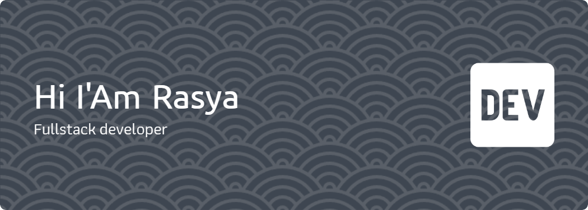

<h1 align="center">
    
</h1>

<h3 align="center">Saya seseorang Pengembang Website Fullstack dan juga Game Developer Junior. yang suka sekali akan pengetahuan baru dan selalu ingin belajar hal-hal baru</h3>

 

 
 🤓 Saya mahasiswa di salah satu Universitas Yogyakarta yaitu **Universitas Teknologi Yogyakarta ( UTY )**
    
 🎶 Saya suka mengulik hal baru dan belajar hal-hal baru terkait hobi saya.

 🧐 Fun fact **Saya menyukai mie ayam 😋😋**

 

 

 
  
  
  <a href="https://syapratama.vercel.app" target="_blank">
      <!-- sqlite, safari, google-chrome are other good icon options -->
  </a>

 

 
<h2 align="center">⚒️ Languages-Frameworks-Tools ⚒️</h2>
 

    
    
    
    

     
    

     
    

 

  <h2>😎 Contribution Saya 😎</h2>
   
<picture>
  <source media="(prefers-color-scheme: dark)" srcset="https://raw.githubusercontent.com/SyaPratama/SyaPratama/output/pacman-contribution-graph-dark.svg">
  <source media="(prefers-color-scheme: light)" srcset="https://raw.githubusercontent.com/SyaPratama/SyaPratama/output/pacman-contribution-graph.svg">
  
</picture>

     

<h2 align="center">👾 Statistic Saya 👾</h2>
 

 
  
  

  

 

<h1 align="center">
    
</h1>

 

<h1 align="center">
    
</h1>
